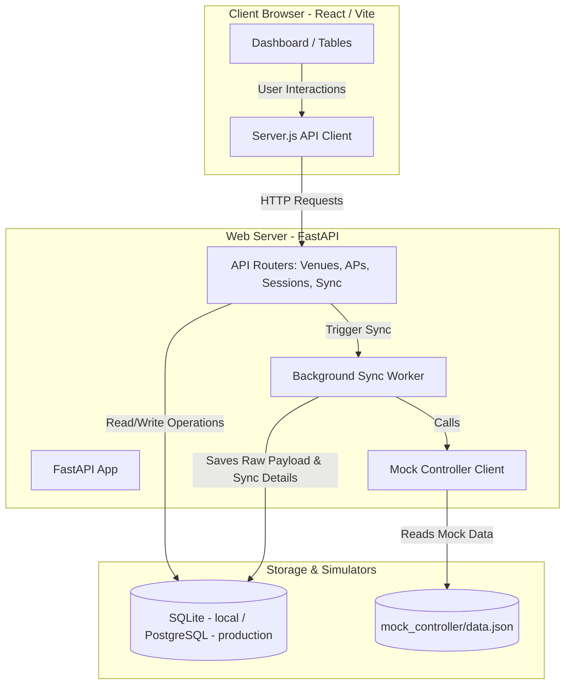

# Wi-Fi Controller System

A full-stack application for monitoring and synchronizing third-party Wi-Fi controller infrastructure (Venues, Access Points, and User Sessions). The project consists of a FastAPI backend and a React (Vite) frontend.

---

## System Architecture

Below is a simple diagram showcasing how the React frontend, FastAPI backend, SQLite database, and Mock Controller interact:



---

## Setup and Run Instructions

### Quick Start (Automated Script)

To automatically verify dependencies, configure the environment, install required packages, and launch both servers in parallel, you can use the provided quick-start scripts:

* **Windows**: Run `start.bat` (either double-click or run from CMD/PowerShell):
  ```cmd
  .\start.bat
  ```
* **macOS / Linux**: Run `start.sh` in the terminal:
  ```bash
  chmod +x start.sh
  ./start.sh
  ```

---

### Manual Setup

### 1. Backend Setup

The backend requires **Python 3.10+**.

1. Navigate to the `Backend` directory:
   ```bash
   cd Backend
   ```

2. Create a virtual environment (recommended):
   ```bash
   python -m venv venv
   ```

3. Activate the virtual environment:
   * **Windows (PowerShell)**:
     ```powershell
     .\venv\Scripts\Activate.ps1
     ```
   * **Windows (CMD)**:
     ```cmd
     .\venv\Scripts\activate.bat
     ```
   * **macOS / Linux**:
     ```bash
     source venv/bin/activate
     ```

4. Install the required dependencies:
   ```bash
   pip install -r requirements.txt
   ```

5. Configure environment variables. A default `.env` is already provided:
   ```env
   DATABASE_URL=sqlite:///./wifi_controller.db
   FRONTEND_URLS=http://localhost:5173,http://127.0.0.1:5173
   ```

6. Run the FastAPI development server:
   ```bash
   uvicorn app.main:app --reload
   ```
   The API will be available at [http://127.0.0.1:8000](http://127.0.0.1:8000). You can explore the interactive documentation (Swagger UI) at [http://127.0.0.1:8000/docs](http://127.0.0.1:8000/docs).

---

### 2. Frontend Setup

The frontend requires **Node.js (v18+)** and **npm**.

1. Navigate to the `Frontend` directory:
   ```bash
   cd Frontend
   ```

2. Install the package dependencies:
   ```bash
   npm install
   ```

3. Configure environment variables. A default `.env` is already provided:
   ```env
   VITE_API_BASE=http://localhost:8000
   ```

4. Start the frontend development server:
   ```bash
   npm run dev
   ```
   The application will be available at [http://localhost:5173](http://localhost:5173).

---

## Database Strategy: SQLite (local) → PostgreSQL (production)

The project uses **SQLite** for local development and **PostgreSQL** in production (hosted on Render).

### Why SQLite locally?
1. **Zero Configuration**: No docker containers or database server processes needed — just run the app.
2. **Portability**: The entire database is a single `wifi_controller.db` file, easy to share and reset.
3. **ORM Abstraction**: SQLAlchemy makes the schema fully database-agnostic — switching databases only requires changing `DATABASE_URL`.

### Why PostgreSQL in production?
* **Persistence**: Data survives deploys and restarts, unlike an ephemeral filesystem.
* **Concurrency**: Row-level locking handles concurrent syncs and API reads far better than SQLite's file-level locking.
* **Scale**: Built for large datasets and high-throughput workloads.

The `DATABASE_URL` environment variable controls which database is used. Render injects the PostgreSQL connection string automatically via `render.yaml`.

---

## Deployment

The app is deployed with the **Frontend on Vercel** and the **Backend + PostgreSQL on Render**.

### Step 1 — Deploy Backend to Render

1. Push this repo to GitHub (if not already done).
2. Go to [render.com](https://render.com) → **New** → **Blueprint**.
3. Connect your GitHub repo — Render will detect `render.yaml` and automatically create:
   - A **Web Service** (`wifi-controller-backend`) running the FastAPI app
   - A **PostgreSQL database** (`wifi-controller-db`) linked to it via `DATABASE_URL`
4. Click **Apply** and wait for the build to finish.
5. Copy the public URL (e.g. `https://wifi-controller-backend.onrender.com`).

### Step 2 — Deploy Frontend to Vercel

1. Go to [vercel.com](https://vercel.com) → **Add New Project** → import your GitHub repo.
2. Set the **Root Directory** to `Frontend`.
3. Add an **Environment Variable** in Vercel:
   ```
   VITE_API_BASE = https://wifi-controller-backend.onrender.com
   ```
4. Click **Deploy**. Vercel detects Vite automatically — no extra config needed.
5. Copy the Vercel URL (e.g. `https://wifi-controller.vercel.app`).

### Step 3 — Update CORS on Render

1. In the Render dashboard → `wifi-controller-backend` → **Environment**.
2. Update `FRONTEND_URLS` to include your Vercel URL:
   ```
   https://wifi-controller.vercel.app,http://localhost:5173,http://127.0.0.1:5173
   ```
3. Render will auto-redeploy.

### Step 4 — Populate the Database

Trigger a sync from the live frontend — the first sync will populate the PostgreSQL database fresh.

> **Note**: The free tier of Render's web service spins down after 15 minutes of inactivity. The first request after a cold start may take ~30 seconds.

---

## Assumptions Made

1. **Local Simulates Remote**: The third-party Wi-Fi controller is simulated locally by reading from `Backend/mock_controller/data.json` instead of executing external HTTP/REST calls.
2. **FastAPI Background Tasks**: The synchronization process runs asynchronously inside FastAPI's `BackgroundTasks` runner to avoid blocking client API response times.
3. **CORS Configuration**: The frontend and backend run on separate local ports (`5173` and `8000` respectively), and FastAPI CORS middleware allows communication between them.
4. **Data Uniqueness**: Access Points, Venues, and Sessions are matched and updated by their unique external IDs returned by the controller mock.
5. **No Authentication**: The dashboard is treated as an internal tool. No login, session management, or role-based access control was implemented, as the assignment scope focused on the integration and sync pipeline rather than user management.

---

## Future Improvements

If we had more time, the following enhancements would be prioritized:
1. **Database Migrations**: Integrate `Alembic` for database schema migrations to cleanly version database revisions.
2. **Authentication & Authorization**: Implement user roles, authentication (JWT/OAuth2), and scope-based permissions to protect endpoints.
3. **Real-time Updates**: Leverage **WebSockets** or **Server-Sent Events (SSE)** to push synchronization progress updates to the frontend dashboard instead of relying on client-side polling.
4. **Testing Suite**:
   * Implement unit tests on the backend using `pytest` and database transaction rollbacks.
   * Add frontend unit and integration tests using `Vitest` and `React Testing Library`.
5. **Robust Controller Client**: Expand the mock client into a multi-provider driver supporting real APIs (e.g., Cisco Meraki API or Ubiquiti UniFi API) via dynamic driver configuration.
6. **AI-Powered Insights**: Add an AI-powered insights feature that analyses session data to surface venue activity summaries and anomalies for operators, using a real LLM API with rule-based fallback.


---

## AI Tools Usage Note

Antigravity was used throughout the development process to accelerate coding tasks — including scaffolding the FastAPI routers, writing SQLAlchemy models, and structuring the React components. All generated code was reviewed, understood, and adapted to fit the project's specific requirements. Claude (Anthropic) was used during the planning phase to think through the database schema, API design decisions, and overall project structure.
