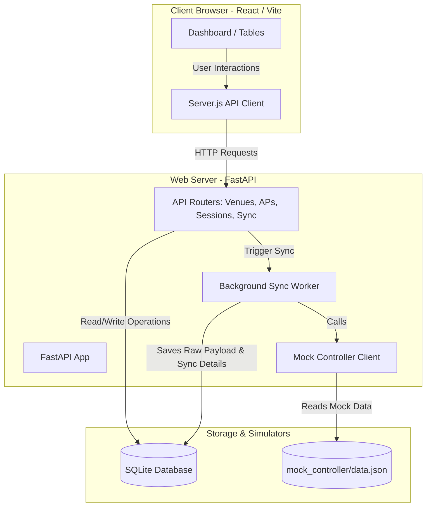

# Wi-Fi Controller System

A full-stack application for monitoring and synchronizing third-party Wi-Fi controller infrastructure (Venues, Access Points, and User Sessions). The project consists of a FastAPI backend and a React (Vite) frontend.

---

## System Architecture

Below is a simple diagram showcasing how the React frontend, FastAPI backend, SQLite database, and Mock Controller interact:



---

## Setup and Run Instructions

### Quick Start (Automated Script)

To automatically verify dependencies, configure the environment, install required packages, and launch both servers in parallel, you can use the provided quick-start scripts:

* **Windows**: Run `start.bat` (either double-click or run from CMD/PowerShell):
  ```cmd
  .\start.bat
  ```
* **macOS / Linux**: Run `start.sh` in the terminal:
  ```bash
  chmod +x start.sh
  ./start.sh
  ```

---

### Manual Setup

### 1. Backend Setup

The backend requires **Python 3.10+**.

1. Navigate to the `Backend` directory:
   ```bash
   cd Backend
   ```

2. Create a virtual environment (recommended):
   ```bash
   python -m venv venv
   ```

3. Activate the virtual environment:
   * **Windows (PowerShell)**:
     ```powershell
     .\venv\Scripts\Activate.ps1
     ```
   * **Windows (CMD)**:
     ```cmd
     .\venv\Scripts\activate.bat
     ```
   * **macOS / Linux**:
     ```bash
     source venv/bin/activate
     ```

4. Install the required dependencies:
   ```bash
   pip install -r requirements.txt
   ```

5. Configure environment variables. A default `.env` is already provided:
   ```env
   DATABASE_URL=sqlite:///./wifi_controller.db
   FRONTEND_URLS=http://localhost:5173,http://127.0.0.1:5173
   ```

6. Run the FastAPI development server:
   ```bash
   uvicorn app.main:app --reload
   ```
   The API will be available at [http://127.0.0.1:8000](http://127.0.0.1:8000). You can explore the interactive documentation (Swagger UI) at [http://127.0.0.1:8000/docs](http://127.0.0.1:8000/docs).

---

### 2. Frontend Setup

The frontend requires **Node.js (v18+)** and **npm**.

1. Navigate to the `Frontend` directory:
   ```bash
   cd Frontend
   ```

2. Install the package dependencies:
   ```bash
   npm install
   ```

3. Configure environment variables. A default `.env` is already provided:
   ```env
   VITE_API_BASE=http://localhost:8000
   ```

4. Start the frontend development server:
   ```bash
   npm run dev
   ```
   The application will be available at [http://localhost:5173](http://localhost:5173).

---

## Database Trade-off: SQLite vs PostgreSQL

We have chosen to use **SQLite** as the primary database for local development.

### Why SQLite?
1. **Zero Configuration**: SQLite does not require spinning up external docker containers or managing database server processes, saving significant development and setup time.
2. **Portability**: The entire database is contained within a single `wifi_controller.db` file, making it exceptionally easy to share, test, and run locally out of the box.
3. **ORM Abstraction**: We utilize SQLAlchemy as our ORM. This means our schema—modeling `Venues`, `AccessPoints`, `Sessions`, and `SyncLogs`—is entirely database-agnostic.

### Trade-offs
While SQLite is excellent for rapid prototyping and local development, it has limitations in a production environment:
* **Concurrency**: SQLite handles concurrent reads well but locks the entire database file during writes. In a high-traffic production scenario with many frequent syncs or concurrent users, PostgreSQL's row-level locking would be necessary.
* **Scale**: PostgreSQL is built to handle massive datasets natively, whereas SQLite's performance can degrade on extremely large database files.
* **Advanced Types**: PostgreSQL supports advanced indexing and data types (like native JSON/JSONB and array types) that SQLite does not fully support.

*Note: Because we use SQLAlchemy, transitioning to PostgreSQL in the future is as simple as updating the `DATABASE_URL` in the `.env` file to a `postgresql://` connection string and installing `psycopg2`. No schema code changes are required.*

---

## Assumptions Made

1. **Local Simulates Remote**: The third-party Wi-Fi controller is simulated locally by reading from `Backend/mock_controller/data.json` instead of executing external HTTP/REST calls.
2. **FastAPI Background Tasks**: The synchronization process runs asynchronously inside FastAPI's `BackgroundTasks` runner to avoid blocking client API response times.
3. **CORS Configuration**: The frontend and backend run on separate local ports (`5173` and `8000` respectively), and FastAPI CORS middleware allows communication between them.
4. **Data Uniqueness**: Access Points, Venues, and Sessions are matched and updated by their unique external IDs returned by the controller mock.
5. **No Authentication**: The dashboard is treated as an internal tool. No login, session management, or role-based access control was implemented, as the assignment scope focused on the integration and sync pipeline rather than user management.

---

## Future Improvements

If we had more time, the following enhancements would be prioritized:
1. **Database Migrations**: Integrate `Alembic` for database schema migrations to cleanly version database revisions.
2. **Authentication & Authorization**: Implement user roles, authentication (JWT/OAuth2), and scope-based permissions to protect endpoints.
3. **Real-time Updates**: Leverage **WebSockets** or **Server-Sent Events (SSE)** to push synchronization progress updates to the frontend dashboard instead of relying on client-side polling.
4. **Testing Suite**:
   * Implement unit tests on the backend using `pytest` and database transaction rollbacks.
   * Add frontend unit and integration tests using `Vitest` and `React Testing Library`.
5. **Robust Controller Client**: Expand the mock client into a multi-provider driver supporting real APIs (e.g., Cisco Meraki API or Ubiquiti UniFi API) via dynamic driver configuration.
6. **AI-Powered Insights**: Add an AI-powered insights feature that analyses session data to surface venue activity summaries and anomalies for operators, using a real LLM API with rule-based fallback.


---

## AI Tools Usage Note

Antigravity was used throughout the development process to accelerate coding tasks — including scaffolding the FastAPI routers, writing SQLAlchemy models, and structuring the React components. All generated code was reviewed, understood, and adapted to fit the project's specific requirements. Claude (Anthropic) was used during the planning phase to think through the database schema, API design decisions, and overall project structure.
